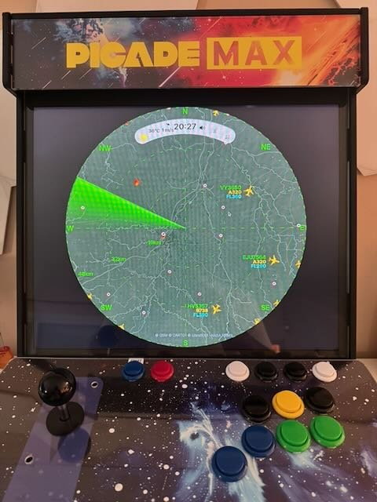
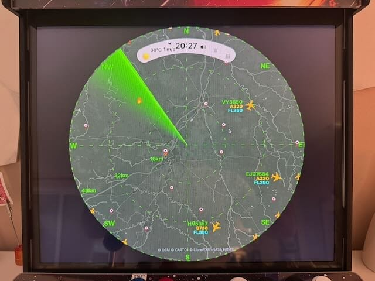
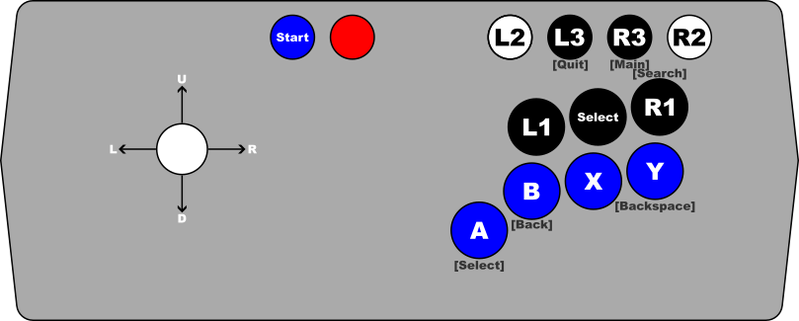
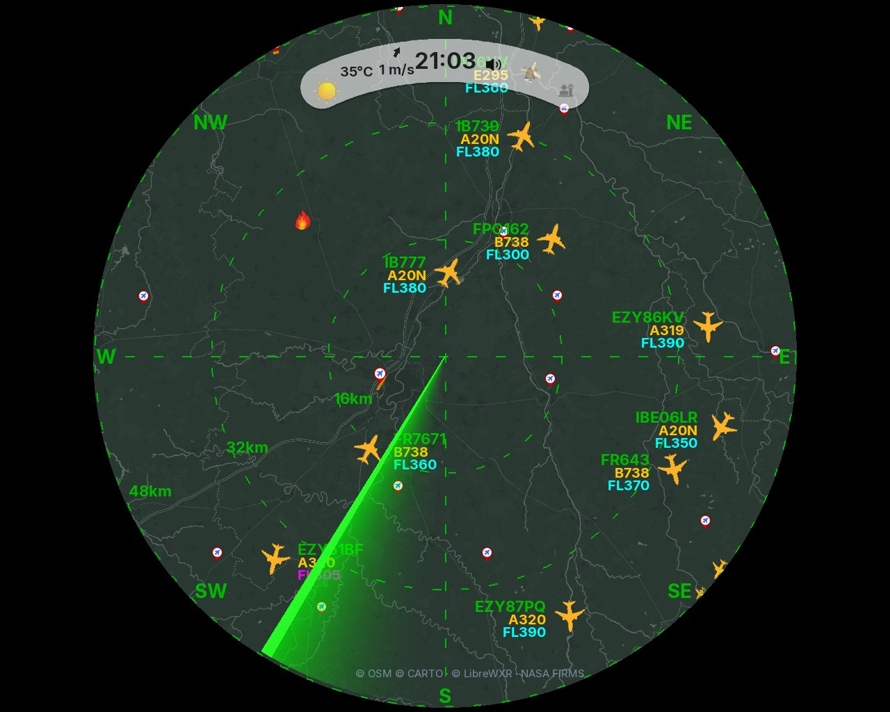
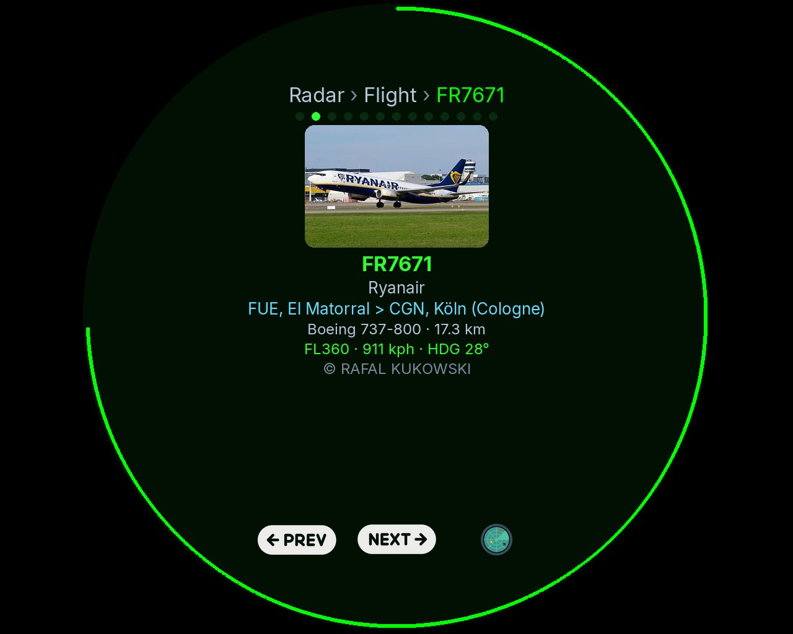
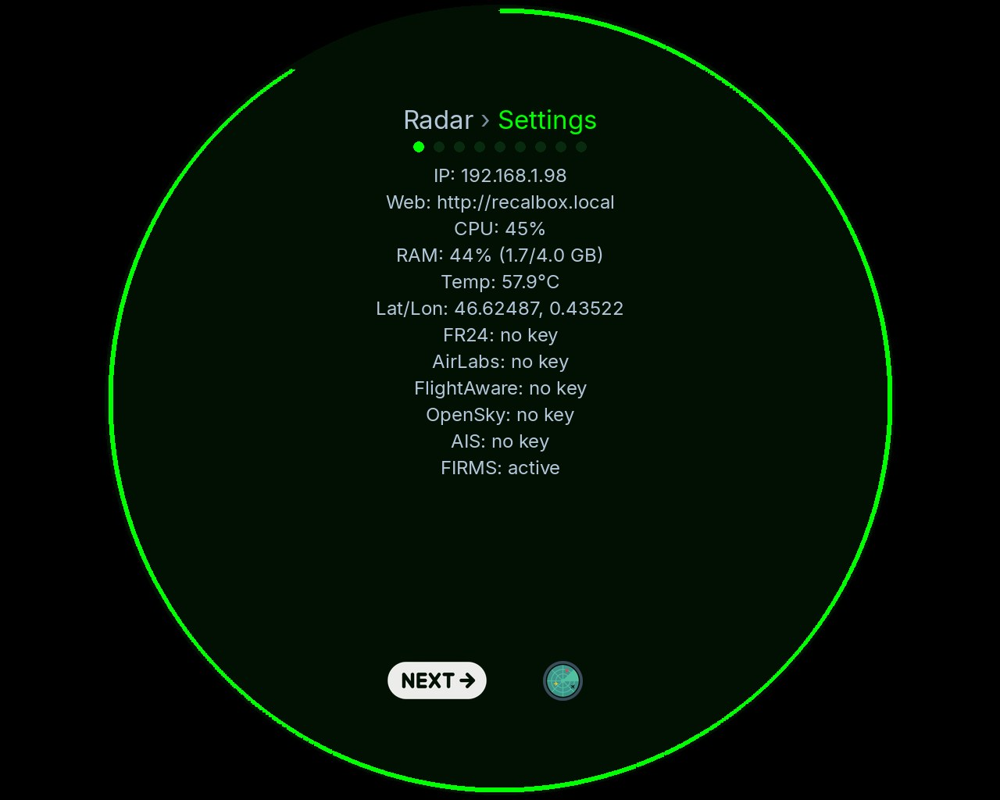

# FlightScnr Pi — Picade cabinet version

This branch (`feat/picade`) adapts FlightScnr Pi to an arcade cabinet: a large
rectangular screen instead of the round 4in panel, and a joystick with panel
buttons instead of a touchscreen.

Nothing here is Picade-specific by design — the same settings run FlightScnr on
**any screen attached to a Pi**. See [Using another screen](#using-another-screen).

 · 



<sub>Image: Pimoroni, "Setting up Picade Max" —
https://learn.pimoroni.com/article/setting-up-picade-max</sub>

---

## What changes

| | Upstream | This branch |
|---|---|---|
| Screen | round 4in DSI panel, 720×720 | any panel; tested on 1280×1024 |
| Pointing | capacitive touchscreen | mouse, or joystick mapped to the pointer |
| Navigation | swipe gestures | panel buttons |
| Range | pinch to zoom | zoom buttons |

## Display

The radar is drawn into a **square** buffer, centred on the panel, with the
sides left black. On a 1280×1024 screen that gives a 1024×1024 radar and two
128px bands:

```ini
DISPLAY_WIDTH=1024
DISPLAY_HEIGHT=1024
DISPLAY_ROTATION=0
```



Three adaptations were needed for a screen this large:

- **`UI_SCALE`** — layout sizes derive from the panel resolution, so a big panel
  magnifies every label and icon. This multiplier decouples the chrome from the
  resolution: below 1.0 it shrinks fonts, aircraft icons and grid dashes,
  leaving more of the circle for map detail. The basemap picks its own tile zoom
  and is unaffected. `1.0` keeps the stock proportions.
- **Pointer offset** — a window narrower than the panel is centred, but SDL
  reports pointer positions in desktop space. Without correction every click
  lands offset by the side band: menus still work (their targets span the width)
  while aircraft can never be hit. The offset is now subtracted before
  hit-testing, and is zero on square panels.
- **Chrome weight** — the corner mask outside the circle is painted black so it
  matches the side bands, range rings and crosshairs are drawn hairline, and the
  crosshairs stop short of the N/E/S/W letters instead of striking through them.

## Input

There is no touchscreen, so the two input paths are:

| Layer | Component | Role |
|---|---|---|
| System | `picade-pointer.service` | joystick and some buttons → virtual mouse and keyboard (`/dev/uinput`) |
| Application | FlightScnr (`joystick_nav.py`) | panel buttons read from SDL → UI actions |

The `flightscnr/setup/picade-pointer` daemon creates `Picade Virtual Mouse` and
`Picade Virtual Keyboard`. FlightScnr knows nothing about them: it receives
ordinary mouse and keyboard events, which is the path it already uses under
Wayland/Xwayland. Stick motion uses an acceleration ramp — slow at first for
aiming, faster while a direction is held.

The stick is **not** read by the application itself: pointer duty and swipe duty
would conflict on the same axes.

### System layer — pointer and keys

| Button | Emits |
|---|---|
| Joystick | pointer motion |
| X | left click |
| Y | right click |
| Select (black) | Enter |
| Start | Tab |
| Red, next to Start | Space |

### Application layer — FlightScnr bindings

Bound by SDL button index in `/etc/flightscnr.env`:

| Button | SDL index | Setting | Action |
|---|---|---|---|
| B | 1 | `JOYSTICK_BTN_RADAR` | back to radar |
| L1 | 6 | `JOYSTICK_BTN_SWIPE_LEFT` | swipe left |
| R1 | 7 | `JOYSTICK_BTN_SWIPE_RIGHT` | swipe right |
| L2 | 8 | `JOYSTICK_BTN_ZOOM_OUT` | zoom out (wider range) |
| R2 | 9 | `JOYSTICK_BTN_ZOOM_IN` | zoom in (shorter range) |

What the two swipe buttons do depends on the screen:

| Screen | Swipe left | Swipe right |
|---|---|---|
| Radar | open Settings | open Tracked flights |
| Settings | next page | previous page, then back to radar |
| Flight detail | next flight | previous flight |
| Fire detail | next fire | previous fire |
| Tracked flights | back to radar | — |

Every binding is unset by default, so a touchscreen install is unaffected.

### Screens

The upstream screens are unchanged — only the way you reach them differs. Flight
detail is opened by clicking an aircraft, then walked with the swipe buttons
instead of the PREV / NEXT footer; Settings pages are stepped with the same two
buttons rather than tapping the breadcrumb.

 · 

### Finding a button index

SDL indices are not printed on the panel. Press an unbound button and read the
log:

```bash
journalctl -u flightscnr -f | grep "cabinet button"
# INFO: Unbound cabinet button 4 pressed
```

## Configuration

```ini
# /etc/flightscnr.env
DISPLAY_WIDTH=1024
DISPLAY_HEIGHT=1024
DISPLAY_ROTATION=0
UI_SCALE=0.7                # chrome scale, 0.2-3.0 (1.0 = stock)
SHOW_MOUSE_CURSOR=True      # with no touchscreen you need to see where you aim

JOYSTICK_BTN_SWIPE_LEFT=6
JOYSTICK_BTN_SWIPE_RIGHT=7
JOYSTICK_BTN_RADAR=1
JOYSTICK_BTN_ZOOM_OUT=8
JOYSTICK_BTN_ZOOM_IN=9
```

## Known limitations

- **Sliders are awkward with the stick.** Brightness, ATC and chime volume, HUD
  and VFR opacity, and the theme RGB channels are all press-and-drag controls.
  Driving them means holding the click button while steering the stick, which is
  imprecise. They remain easy with a real mouse. *TODO: step them with the swipe
  or zoom buttons when a slider has focus.*
- **No pinch to zoom.** Pinch needs multi-touch, which pointer emulation cannot
  provide. Use the zoom buttons, or Settings → Options → Range.
- **Vertical navigation has no button.** Swipe up/down (radar → Details, radar →
  Clock, and page scrolling) is reachable with the mouse only. Two more bindings
  would cover it.

## Using another screen

Nothing above is tied to the Picade. For any panel on a Pi:

1. Set `DISPLAY_WIDTH` and `DISPLAY_HEIGHT` to the **square side** you want —
   normally the smaller of the panel's two dimensions, so the radar fills the
   height. The app centres that square and blacks out the rest.
2. Tune `UI_SCALE` until labels and icons look right at your viewing distance.
   Larger panel or closer viewing → smaller value.
3. Leave the rest alone: the pointer offset is computed from the panel and the
   buffer, so clicks land correctly with no extra setting.

A touchscreen of any size works the same way, without the pointer daemon or the
button bindings.

## Installation

`install-pi.sh` handles the pointer service in `install_pointer_service()`: the
systemd unit is generated from `flightscnr/setup/picade-pointer.service`, and the
`uinput` module is queued for boot (`/etc/modules-load.d/picade-pointer.conf`) —
without it `/dev/uinput` does not exist and the daemon fails at every boot.
